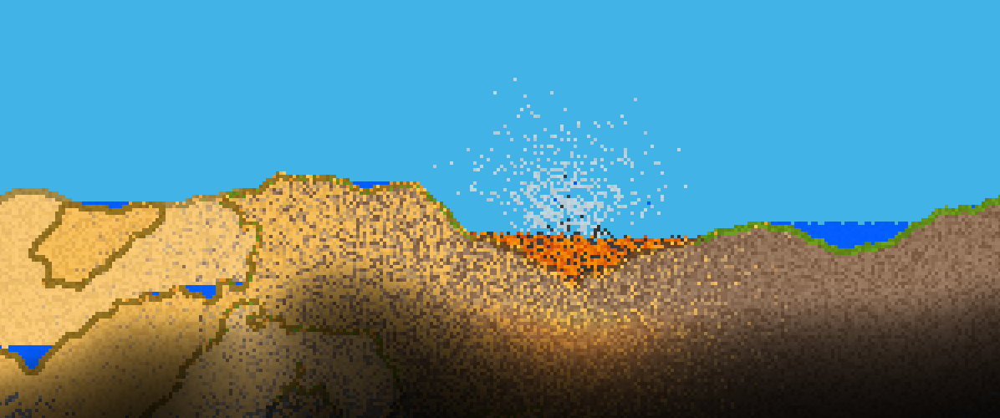
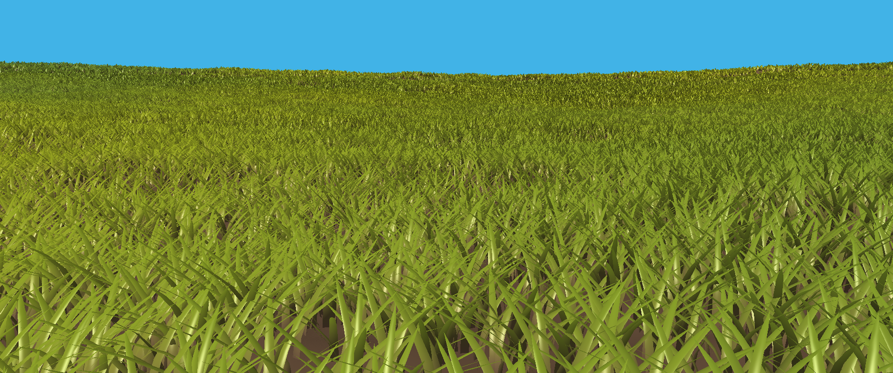
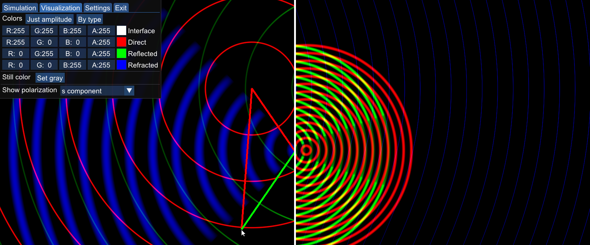

# RealEngine: A Vulkan-based engine-like library

## Features:

* A set of convenient classes to ease Vulkan 1.3 rendering
* Automatic codegen to get SPIR-V from shaders or to reuse GLSL code in C++
* Handling of mouse & keyboard input
* Simulation speed decoupled from variable frame rate
* A system of rooms / scenes / worlds with well defined transitions
* Supports Windows (MSVC) and Linux (GCC)

## Design goals:

* A lightweight library, not a full-fledged engine with all sorts of subsystems
* As little runtime overhead as possible
* A modern type-safe C++23 library following [C++ Core Guidelines](https://isocpp.github.io/CppCoreGuidelines/CppCoreGuidelines)
* Doxygen-documented at least at class level

## The library was used to develop:

#### [RealWorld](https://github.com/ZADNE/RealWorld): A real-time tile-based game world simulation demo

#### [Meadow](https://github.com/ZADNE/Meadow): A real-time grass rendering demo

#### [Waves](https://github.com/ZADNE/Waves): A Fresnel equations visualizer

## The following libraries must be installed to build:

* [SDL2](https://www.libsdl.org/) (for user input and window creation)
* [SDL2_ttf](https://wiki.libsdl.org/SDL2_ttf/FrontPage) (for font rasterization)
* [Vulkan SDK](https://www.lunarg.com/vulkan-sdk/) (for GPU-accelerated rendering and compute)

See documentation on .