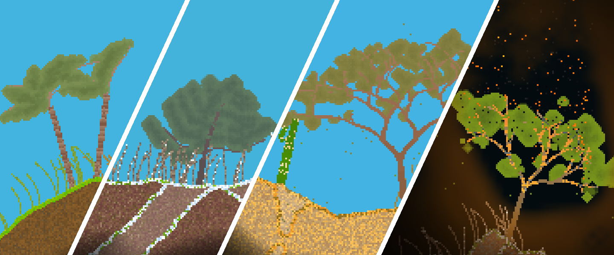

# RealEngine: A Vulkan-based engine-like library

## Features:
- A set of convenient classes to ease Vulkan 1.3 rendering
- Handling of mouse & keyboard input
- Simulation speed decoupled from variable frame rate
- A system of rooms / scenes / worlds with well defined transitions
- Supports Windows (MSVC) and Linux (GCC)

## Design goals:

- A lightweight library, not a full-fledged engine with all sorts of subsystems
- As little runtime overhead as possible
- A modern type-safe C++20 library following [C++ Core Guidelines](https://isocpp.github.io/CppCoreGuidelines/CppCoreGuidelines)
- Doxygen documented at least at class level

## The library was used to develop:

#### [RealWorld](https://github.com/ZADNE/RealWorld): A real-time tile-based game world simulation demo

#### [Meadow](https://github.com/ZADNE/Meadow): A real-time grass rendering demo

#### [Waves](https://github.com/ZADNE/Waves): A Fresnel equations visualizer

## The following libraries are required to build:

- [SDL2](https://www.libsdl.org/)
- [Vulkan SDK](https://www.lunarg.com/vulkan-sdk/)